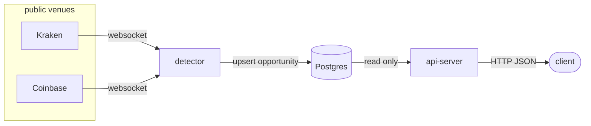
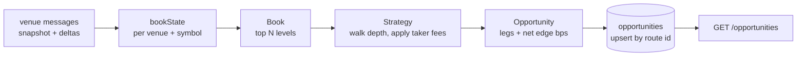

# arb-scanner

A backend service which looks for price mismatches across crypto exchanges and identifies profitable opportunities.

Two exchanges are covered (Coinbase and Kraken) with a cross-venue strategy to identify opportunities.

## Quick start

### Prerequisites

Docker with Compose v2 (`docker compose`), or podman with `podman-compose` — see
the podman note at the end of this section. Nothing else: the images build Go
inside the build stage, and the migration and seed steps run `psql` from the
same `postgres:16-alpine` image, so no local Go or Postgres client is needed.

### Run with Docker Compose

```bash
docker compose up -d --build
```

That starts Postgres, applies the migrations, loads four demonstration rows,
and brings up the two long-running services: `detector`, which streams the
Kraken and Coinbase websocket books and writes opportunities, and `api-server` on
[localhost:8080](http://localhost:8080).

```bash
curl -s localhost:8080/health
curl -s 'localhost:8080/opportunities?limit=5'
```

**The rows you see first are seed data, not detections.** `seed` runs on every
`up` and loads four fixed demo routes so the API has something to serve before
a live opportunity appears; a real cross-venue edge on BTC/USD or ETH/USD is
rare and may not occur while you watch. Detected rows are distinguishable by
their recent `last_seen_at`. To start from an empty table:

```bash
./scripts/seed.sh --reset   # truncates, then reloads only the demo rows
```

Follow the detector to see evaluation happening regardless:

```bash
docker compose logs -f detector
```

Tear down, keeping the database volume:

```bash
docker compose down
```

## Assumptions

Both venues are pre-funded and the available capital is unbounded, transfers and their costs are out of scope.

For taker fees, assume a $1M 30-day volume tier for both exchanges. These fees are assumed to be flat and the same across different symbols.
Kraken (0.18%)
https://www.kraken.com/features/fee-schedule
Coinbase (0.18%)
https://exchange.coinbase.com/fees

Latency is not modelled, assuming that all legs of a trading opportunity can be filled simultaneously at the current book price.

## Architecture



The backend application is split into two processes: the detector which subscribes to the venue market data to build up the current state of the order book and identify trading opportunities between the two exchanges, and the api-server which exposes the REST endpoints to query the identified opportunities.

The read and write paths are separated into two apps rather than a single process to allow for isolation, scaling and availability. For example:
- reader process can be scaled horizontally to accommodate read requests
- new strategies can be deployed independently
- issues with the venue feed do not affect the read process

The postgres table acts as the contract between the detector and api-server process.

### Data flow

Basic data flow through the app for generating and reading opportunities.



## Opportunity Detection

The detection process subscribes to multiple exchanges, via websockets, and maintains the L2 order book in memory. Multiple different symbols can be subscribed to for each exchange (e.g. "BTC/USD", "ETH/USD").

The strategies are evaluated at a fixed interval against the current state of the order book to identify trading opportunities. Constraints are set for the max acceptable staleness of the order book, so a disconnected or stalled feed does not produce opportunities against stale prices. Candidate opportunities must clear a minimum net edge and quote size to prevent publishing negligible results.

In the case of the cross-venue strategy we look for trading opportunities where the asset can be bought on one exchange and sold on another for a profit, minus fees. Both exchanges' order books are walked in parallel consuming the quantities for the available asks (buy side) and bids (sell side) and stop when the fee adjusted bid is no longer greater than the fee adjusted ask.

## Data model

### Schema

```
CREATE TABLE opportunities (
    id            TEXT PRIMARY KEY,
    strategy      TEXT        NOT NULL,
    config_id     TEXT        NOT NULL,
    first_seen_at TIMESTAMPTZ NOT NULL,
    last_seen_at  TIMESTAMPTZ NOT NULL,
    start_asset   TEXT        NOT NULL,
    amount_in     NUMERIC     NOT NULL,
    amount_out    NUMERIC     NOT NULL,
    gross_profit  NUMERIC     NOT NULL,
    fees          NUMERIC     NOT NULL,
    net_profit    NUMERIC     NOT NULL,
    net_edge_bps  NUMERIC     NOT NULL,
    max_edge_bps  NUMERIC     NOT NULL,
    legs          JSONB       NOT NULL
);

CREATE INDEX opportunities_strategy_last_seen_idx
    ON opportunities (strategy, last_seen_at DESC);
```

## API

Backend API served by default on port 8080. Acts as a read-only service for querying opportunities.

### GET /opportunities

The backend is pre-loaded with opportunity data for demo purposes. This can be queried with:
/opportunities?from=2026-09-06T00:00:00Z&to=2026-09-07T00:00:00Z
```
{
    "opportunities":[
        {
            "id":"e1cde795532b4c18a67c57290c8d6cf2",
            "strategy":"cross_venue",
            "config_id":"v1",
            "first_seen_at":"2026-09-06T08:44:35.281035Z",
            "last_seen_at":"2026-09-06T08:53:15.281035Z",
            "start_asset":"USD",
            "amount_in":"14528.27556",
            "amount_out":"14562.3168",
            "gross_profit":"130.2",
            "fees":"96.15876",
            "net_profit":"34.04124",
            "net_edge_bps":"23.431",
            "max_edge_bps":"42.1758",
            "legs":[{
                "venue":"kraken",
                "symbol":"ETH/USD",
                "side":"buy",
                "base":"ETH",
                "quote":"USD",
                "asset_in":"USD",
                "asset_out":"ETH",
                "amount_in":"14528.27556",
                "amount_out":"6",
                "price":"2415.1",
                "qty":"6",
                "fee":"37.67556",
                "levels_consumed":1,
                "book_at":"2026-09-06T08:53:34.281035Z"
            },
            ... additional legs.
            ]
        },
    ... additional opportunities.
    ]
}
```

### GET /strategies
List the available strategies
```
{
    "strategies":["cross_venue"],
    "count":1
}
```

### GET /health
Health check
```
{"status":"ok"}
```

## Testing

### Running the tests

```bash
docker compose --profile test run --rm test
```

Unit tests only: no network, no database. Tagged tests are excluded by default —
`db` runs against the compose Postgres, dropping and recreating `arb_test`;
`live` tests against the Kraken and Coinbase exchanges.

```bash
docker compose --profile test run --rm test go test -tags=db ./...
docker compose --profile test run --rm test go test -tags=live ./...
```

## Trade-offs and what I would do next
