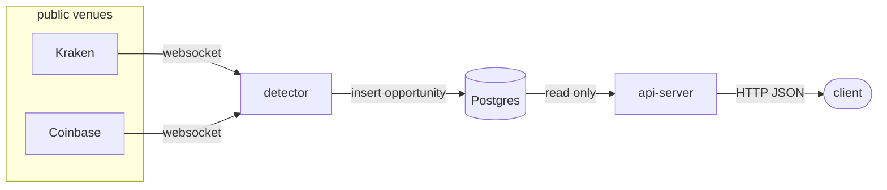
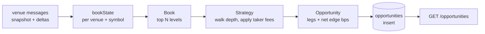

# arb-scanner

A backend service which looks for price mismatches across crypto exchanges and identifies profitable opportunities.

Two exchanges are covered (Coinbase and Kraken) with a cross-venue strategy to identify opportunities.

## Quick start

### Run with Docker Compose

```bash
docker compose up -d --build
```

The api-server runs on [localhost:8080](http://localhost:8080). On startup the database is pre-populated with four demonstration rows; these are not real detections. The detector service connects to Kraken and Coinbase websocket books and writes opportunities.

Example requests:
```bash
curl -s localhost:8080/health
curl -s 'localhost:8080/opportunities?limit=5'
```

To follow the detector logs which are by default set to debug mode for demonstration purposes:
```bash
docker compose logs -f detector
```

Tear down:

```bash
docker compose down
```

### Running the tests

```bash
docker compose --profile test run --rm test
```

Unit tests only: no network, no database. Tagged tests are excluded by default —
`db` runs against the compose Postgres, dropping and recreating `arb_test`;
`live` tests against the Kraken and Coinbase exchanges.

```bash
docker compose --profile test run --rm test go test -tags=db ./...
docker compose --profile test run --rm test go test -tags=live ./...
```

### Config

The configuration is currently hardcoded in the [main.go](cmd/detector/main.go) file. The parameters are set with reasonable defaults and configured to detect for BTC/USD and ETH/USD markets. Ideally this should be shifted to a yaml config file with individual configurations for each detection strategy.

Given that arbitrage opportunities are small between exchanges, with the given defaults it is unlikely that an opportunity will be found during a live run. The krakenFee, coinbaseFee, minEdgeBps and minSizeQuote can all be set to 0 to demonstrate a live detection.

## Assumptions

Both venues are pre-funded and the available capital is unbounded. Transfers and their costs are out of scope.

For taker fees, assume a $1M 30-day volume tier for both exchanges. These fees are assumed to be flat and the same across different symbols.

Kraken (0.18%)
https://www.kraken.com/features/fee-schedule

Coinbase (0.18%)
https://exchange.coinbase.com/fees

Latency is not modelled, assuming that all legs of a trading opportunity can be filled simultaneously at the current book price.

## Architecture



The backend application is split into two processes: the detector, which subscribes to the venue market data to build up the current state of the order book and identify trading opportunities between the two exchanges, and the api-server, which exposes the REST endpoints to query the identified opportunities.

The read and write paths are separated into two apps rather than a single process to allow for isolation, independent scaling and availability. For example:
- the reader process can be scaled horizontally to accommodate read requests.
- a dropped feed or crashed detector process does not stop the serving of existing opportunities.
- redeployment of the api-server does not affect existing venue subscriptions or the in-memory order books.

The trade-off here is that the two processes can only communicate through the Postgres table, which acts as the contract between them, rather than reading a live stream of updates within a single process. This is revisited in [Further Work](#further-work).

### Data flow

Basic data flow through the app for generating and reading opportunities.



## Opportunity Detection

The detection process subscribes to multiple exchanges via websockets and maintains the L2 order book in memory. Multiple different symbols can be subscribed to for each exchange (e.g. "BTC/USD", "ETH/USD").

The strategies are evaluated at a fixed interval against the current state of the order book to identify trading opportunities. Constraints are set for the max acceptable staleness of the order book, so a disconnected or stalled feed does not produce opportunities against stale prices. Candidate opportunities must clear a minimum net edge and quote size to prevent publishing negligible results.

In the case of the cross-venue strategy we look for trading opportunities where the asset can be bought on one exchange and sold on another for a profit, minus fees. Both exchanges' order books are walked in parallel consuming the quantities for the available asks (buy side) and bids (sell side), stopping when the fee adjusted bid is no longer greater than the fee adjusted ask.

## Market Data Handling

We subscribe to market data from two venues, Kraken and Coinbase. This is done using the L2 order book which covers the pending buys and sells at specific price levels. This was chosen because L1 only shows the top of the book and would not reflect the full size of the trading opportunity. L3 is too granular showing individual orders which we do not care about, since we only require the total quantity available at a price level.

### Error handling
Feed connections invalidate the current order book state if the feed is dropped. There is an exponential backoff for retrying the feed connection. This can be found in the [feed.go](internal/venue/feed.go) file.

The session is restarted if malformed messages are read, because an unprocessed delta message could lead to an incomplete order book state.

The order book is checked for staleness before evaluating. We do not produce opportunities on top of a stale book. Stalled feeds where no message is received for 15s trigger an automatic reconnect.

For Kraken there is a CRC32 checksum to check the order book validity, which checks against the top ten price levels, and this is done on every update. For Coinbase the documentation states that the level2 order book is guaranteed delivery for all updates.

Not covered: a single feed going down does not terminate the detector process, it just excludes that exchange's books from future evaluations. We would need a healthcheck endpoint that can be monitored for any feeds which fail to reconnect.

## Data model

### Schema

```
CREATE TABLE opportunities (
    id           TEXT PRIMARY KEY,
    route_id     TEXT        NOT NULL,
    strategy     TEXT        NOT NULL,
    config_id    TEXT        NOT NULL,
    observed_at  TIMESTAMPTZ NOT NULL,
    start_asset  TEXT        NOT NULL,
    amount_in    NUMERIC     NOT NULL,
    amount_out   NUMERIC     NOT NULL,
    gross_profit NUMERIC     NOT NULL,
    fees         NUMERIC     NOT NULL,
    net_profit   NUMERIC     NOT NULL,
    net_edge_bps NUMERIC     NOT NULL,
    legs         JSONB       NOT NULL
);

CREATE INDEX opportunities_strategy_observed_idx
    ON opportunities (strategy, observed_at DESC);

CREATE INDEX opportunities_route_observed_idx
    ON opportunities (route_id, observed_at DESC);
```

An opportunity row is one sighting, inserted on every tick. route_id is a hash of the venues and symbols traded, while id identifies the specific observation. This maintains a history of the observed opportunities.

The legs track the individual trades made on the specific venues, tracking the volume-weighted average price and quantity traded. Legs are executed in order and can only be valid if the asset_out matches the next leg's asset_in, with the last leg returning to the starting asset. In the case of the cross-venue strategy two legs are created: buy BTC/USD on Kraken, sell BTC/USD on Coinbase, starting and ending in USD.

Example trading leg:
```
{
    Venue: "kraken", Symbol: "BTC/USD", Side: Buy,
    Base: "BTC", Quote: "USD", AssetIn: "USD", AssetOut: "BTC",
    AmountIn: dec("10000"), AmountOut: dec("0.2"), Price: dec("50000"), Qty: dec("0.2"),
}
```

The legs are stored as a JSON blob rather than a separate table because they are read and written as one unit (an opportunity).

## API

Backend API served by default on port 8080. Acts as a read-only service for querying opportunities.

### GET /opportunities

The backend is pre-loaded with opportunity data for demo purposes. This can be queried with:
/opportunities?limit=5
```
{
    "opportunities":[
        {
            "id":"135cf929d7a35ac67ed31edac5f7ea1f",
            "route_id":"e1cde795532b4c18a67c57290c8d6cf2",
            "strategy":"cross_venue",
            "config_id":"v1",
            "observed_at":"2026-09-06T08:53:15.281035Z",
            "start_asset":"USD",
            "amount_in":"14528.27556",
            "amount_out":"14562.3168",
            "gross_profit":"130.2",
            "fees":"96.15876",
            "net_profit":"34.04124",
            "net_edge_bps":"23.431",
            "legs":[{
                "venue":"kraken",
                "symbol":"ETH/USD",
                "side":"buy",
                "base":"ETH",
                "quote":"USD",
                "asset_in":"USD",
                "asset_out":"ETH",
                "amount_in":"14528.27556",
                "amount_out":"6",
                "price":"2415.1",
                "qty":"6",
                "fee":"37.67556",
                "levels_consumed":1,
                "book_at":"2026-09-06T08:53:34.281035Z"
            },
            ... additional legs.
            ]
        },
    ... additional opportunities.
    ]
}
```

### GET /strategies
List the available strategies
```
{
    "strategies":["cross_venue"],
    "count":1
}
```

### GET /health
Health check
```
{"status":"ok"}
```

## Further Work

Possible extensions to the current work, out of scope for this challenge.

- publish opportunities to a Kafka topic. Consumers currently have to poll Postgres and only see what was last written, a topic would give a push stream which could then be forwarded to the end user. This is only if live updates are required, otherwise this is overkill.
- add a retention policy for the opportunities table. It is append-only so it grows with time rather than with the number of routes, with time-based partitioning as the implementation once retention exists.
- report feed health through the API. MaxFeedAge is currently unused and /health cannot tell a caller that a feed or the detector has died, which is the failure the two-process split was meant to make visible.
- move the detector configuration out of main.go and into a config file, with individual configurations per strategy.
- retry or buffer failed writes. For the Store if an insert fails the rows are just logged and dropped.
- add cursor pagination to /opportunities. The response envelope was shaped for it but only limit is supported.
